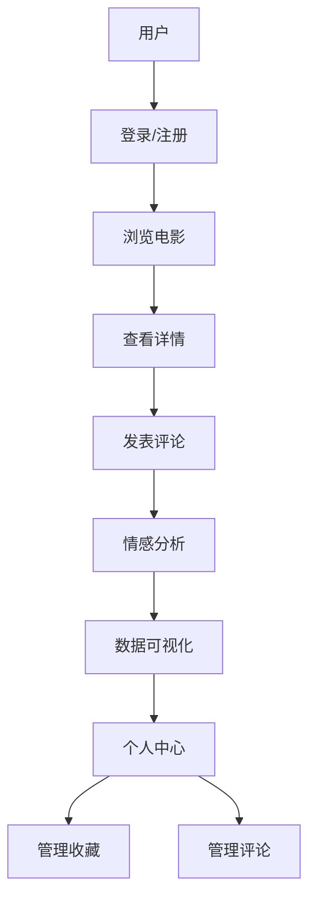

# 系统分析与设计

## 3.1 系统需求分析与建模

### 3.1.1 系统需求概述

基于BERT的中文电影评论情感分析系统旨在通过BERT预训练模型对中文电影评论进行情感分析，在通过爬取互联网上公开的电影数据后，系统需要能够对中文电影评论数据进行数据清洗、评论分词，随后通过BERT模型进行情感分析，计算评论情感指数，将评论数据可视化，最后通过结合电影数据综合展示。

### 3.1.2 需求清单

表3.1 需求功能清单

| 模块 | 功能 | 功能描述 |
| ---- | ---- | -------- |
| 用户管理 | 用户注册 | 新用户通过填写用户名、邮箱和密码进行注册 |
| 用户管理 | 用户登录 | 已注册用户通过用户名和密码进行登录 |
| 用户管理 | 个人信息管理 | 用户可以查看和修改个人信息，包括头像、邮箱等 |
| 电影管理 | 电影信息展示 | 展示电影基本信息，包括标题、导演、演员、类型等 |
| 电影管理 | 电影搜索 | 支持按标题、类型等条件搜索电影 |
| 电影管理 | 电影详情 | 展示电影的详细信息，包括简介、评分、评论等 |
| 评论管理 | 发表评论 | 用户可以对电影发表评论和评分 |
| 评论管理 | 评论列表 | 展示电影的所有评论，支持分页和排序 |
| 评论管理 | 评论删除 | 用户可以删除自己的评论 |
| 情感分析 | 评论情感分析 | 使用BERT模型分析评论的情感倾向 |
| 情感分析 | 情感趋势 | 展示电影评论的情感趋势变化 |
| 数据分析 | 用户行为分析 | 分析用户活跃度和行为模式 |
| 数据分析 | 电影评分分析 | 分析电影评分分布和趋势 |
| 数据分析 | 评论情感分析 | 分析评论情感分布和变化 |
| 系统管理 | 用户权限管理 | 管理员可以管理用户权限和状态 |
| 系统管理 | 数据备份 | 支持系统数据的备份和恢复 |

### 3.1.3 系统数据分析

#### 数据模型设计

1. 用户数据模型
```python
class User(BaseModel):
    id: str
    username: str
    email: EmailStr
    password: str
    avatar: Optional[str] = None
    role: str = "user"
    status: str = "active"
    created_at: datetime
```

用户数据模型采用Pydantic进行定义，主要包含以下字段：
- `id`: 用户唯一标识符
- `username`: 用户名，用于登录和显示
- `email`: 用户邮箱，使用EmailStr类型确保格式正确
- `password`: 加密后的密码
- `avatar`: 用户头像URL，可选字段
- `role`: 用户角色，默认为普通用户
- `status`: 用户状态，默认为活跃
- `created_at`: 用户创建时间

2. 电影数据模型
```python
class Movie(BaseModel):
    id: str
    title: str
    director: str
    actors: List[str]
    genres: List[str]
    release_date: date
    rating: float
    poster: str
    description: str
    created_at: datetime
```

电影数据模型包含以下关键字段：
- `id`: 电影唯一标识符
- `title`: 电影标题
- `director`: 导演信息
- `actors`: 演员列表
- `genres`: 电影类型列表
- `release_date`: 上映日期
- `rating`: 平均评分
- `poster`: 海报图片URL
- `description`: 电影简介
- `created_at`: 数据创建时间

3. 评论数据模型
```python
class Review(BaseModel):
    id: str
    movie_id: str
    user_id: str
    content: str
    rating: float
    sentiment: str
    created_at: datetime
```

评论数据模型包含以下字段：
- `id`: 评论唯一标识符
- `movie_id`: 关联的电影ID
- `user_id`: 发表评论的用户ID
- `content`: 评论内容
- `rating`: 用户评分
- `sentiment`: 情感分析结果
- `created_at`: 评论创建时间

### 3.1.4 系统功能分析

#### 系统功能流程图



系统功能流程说明：
1. 用户首先需要登录或注册才能使用系统功能
2. 登录后可以浏览电影列表
3. 选择感兴趣的电影查看详情
4. 在电影详情页可以发表评论
5. 系统自动对评论进行情感分析
6. 用户可以查看数据分析结果
7. 在个人中心管理收藏和评论

## 3.2 系统设计与建模

### 3.2.1 系统设计概述

系统采用前后端分离架构，主要包含以下组件：

1. 前端：Vue.js 3 + Ant Design Vue
   - 使用Vue 3的Composition API进行组件开发
   - 采用Ant Design Vue提供统一的UI组件
   - 使用Vue Router进行路由管理
   - 使用Pinia进行状态管理

2. 后端：FastAPI + MongoDB
   - FastAPI提供高性能的API服务
   - MongoDB存储系统数据
   - 使用Pydantic进行数据验证
   - 采用JWT进行身份认证

3. 机器学习：BERT模型
   - 使用预训练的BERT-base-chinese模型
   - 针对电影评论进行微调
   - 提供情感分析服务

4. 部署：Docker + Nginx
   - 使用Docker容器化部署
   - Nginx作为反向代理服务器
   - 支持负载均衡和HTTPS

### 3.2.2 系统数据库设计

#### 用户表 (users)
```json
{
    "_id": "ObjectId",
    "username": "string",
    "email": "string",
    "password": "string",
    "avatar": "string",
    "role": "string",
    "status": "string",
    "created_at": "datetime"
}
```

用户表设计说明：
- `_id`: MongoDB自动生成的唯一标识符
- `username`: 用户名，建立唯一索引
- `email`: 用户邮箱，建立唯一索引
- `password`: 使用bcrypt加密存储
- `avatar`: 存储头像URL
- `role`: 用户角色，包括admin和user
- `status`: 用户状态，包括active和inactive
- `created_at`: 记录创建时间

#### 电影表 (movies)
```json
{
    "_id": "ObjectId",
    "title": "string",
    "director": "string",
    "actors": ["string"],
    "genres": ["string"],
    "release_date": "date",
    "rating": "float",
    "poster": "string",
    "description": "string",
    "created_at": "datetime"
}
```

电影表设计说明：
- `_id`: 电影唯一标识符
- `title`: 电影标题，建立文本索引
- `director`: 导演信息
- `actors`: 演员数组，支持多值查询
- `genres`: 类型数组，建立多值索引
- `release_date`: 上映日期
- `rating`: 平均评分
- `poster`: 海报图片URL
- `description`: 电影简介，建立文本索引
- `created_at`: 数据创建时间

#### 评论表 (reviews)
```json
{
    "_id": "ObjectId",
    "movie_id": "ObjectId",
    "user_id": "ObjectId",
    "content": "string",
    "rating": "float",
    "sentiment": "string",
    "created_at": "datetime"
}
```

评论表设计说明：
- `_id`: 评论唯一标识符
- `movie_id`: 关联的电影ID，建立索引
- `user_id`: 用户ID，建立索引
- `content`: 评论内容，建立文本索引
- `rating`: 用户评分
- `sentiment`: 情感分析结果
- `created_at`: 评论时间，建立索引

### 3.2.3 系统用户界面设计

#### 1. 登录界面
- 用户名/密码输入框
  - 使用Ant Design的Input组件
  - 添加表单验证
  - 支持回车提交
- 登录按钮
  - 使用Ant Design的Button组件
  - 添加加载状态
  - 防重复提交
- 注册链接
  - 使用RouterLink组件
  - 添加hover效果
- 记住密码选项
  - 使用Checkbox组件
  - 本地存储密码

#### 2. 电影列表界面
- 电影卡片网格布局
  - 使用Ant Design的Card组件
  - 响应式布局
  - 添加hover效果
- 搜索和筛选功能
  - 支持标题、类型搜索
  - 使用Select组件进行筛选
  - 实时搜索提示
- 分页控件
  - 使用Pagination组件
  - 支持自定义每页数量
- 排序选项
  - 支持评分、时间排序
  - 使用Dropdown组件

#### 3. 电影详情界面
- 电影海报
  - 使用Image组件
  - 支持预览
  - 添加加载动画
- 基本信息展示
  - 使用Descriptions组件
  - 响应式布局
- 评分和评论
  - 使用Rate组件
  - 评论列表分页
- 评论表单
  - 使用Form组件
  - 支持表情输入
  - 字数限制

#### 4. 数据分析界面
- 情感分析图表
  - 使用ECharts
  - 支持交互
  - 响应式布局
- 用户行为分析
  - 折线图展示趋势
  - 支持时间范围选择
- 评分分布图
  - 使用饼图展示
  - 添加动画效果
- 评论趋势图
  - 使用面积图
  - 支持数据筛选

### 3.2.4 系统API接口设计

系统采用RESTful API设计，主要接口包括：

1. 用户相关接口
```python
@app.post("/api/users/register")
async def register(user: UserCreate):
    # 用户注册
    # 1. 验证用户名和邮箱唯一性
    # 2. 密码加密
    # 3. 创建用户记录
    # 4. 返回用户信息

@app.post("/api/users/login")
async def login(form_data: OAuth2PasswordRequestForm = Depends()):
    # 用户登录
    # 1. 验证用户凭证
    # 2. 生成JWT token
    # 3. 返回token信息

@app.get("/api/users/me")
async def read_users_me(current_user: User = Depends(get_current_user)):
    # 获取当前用户信息
    # 1. 验证token
    # 2. 查询用户信息
    # 3. 返回用户数据
```

2. 电影相关接口
```python
@app.get("/api/movies")
async def get_movies(skip: int = 0, limit: int = 10):
    # 获取电影列表
    # 1. 查询电影数据
    # 2. 应用分页
    # 3. 返回电影列表

@app.get("/api/movies/{movie_id}")
async def get_movie(movie_id: str):
    # 获取电影详情
    # 1. 查询电影信息
    # 2. 查询相关评论
    # 3. 返回完整数据
```

3. 评论相关接口
```python
@app.post("/api/reviews")
async def create_review(review: ReviewCreate, current_user: User = Depends(get_current_user)):
    # 创建评论
    # 1. 验证用户权限
    # 2. 情感分析
    # 3. 保存评论
    # 4. 更新电影评分

@app.get("/api/movies/{movie_id}/reviews")
async def get_movie_reviews(movie_id: str, skip: int = 0, limit: int = 10):
    # 获取电影评论
    # 1. 查询评论数据
    # 2. 应用分页
    # 3. 返回评论列表
```

# 4 系统详细设计与实现

## 4.1 实现环境与工具的简要说明

### 4.1.1 硬件环境

1. 开发环境配置：
表4.1 开发环境硬件配置

| 硬件名称 | 基本配置说明 |
| -------- | ------------ |
| 笔记本   | 处理器：Intel® Core(TM) i7-8750H CPU @ 2.20GHz 2.21 GHz RAM：8.00 GB，64位操作系统，Windows 10系统 |
| 服务器   | 处理器：Intel® Xeon(R) CPU E5-2620 v4 @ 2.10GHz 2.10 GHz（4个处理器） RAM：8.00 GB，64位操作系统，Windows Server 2016 Standard |

2. 软件环境：
- 操作系统：Windows 10/Windows Server 2016
- 数据库：MongoDB 4.4+
- Web服务器：Nginx
- 开发工具：PyCharm, WebStorm

### 4.1.2 实现工具

表4.2 项目实现工具

| 工具名称 | 版本 | 用途 |
| -------- | ---- | ---- |
| Python | 3.8+ | 后端开发 |
| Node.js | 14+ | 前端开发 |
| MongoDB | 4.4+ | 数据库 |
| Docker | 20.10+ | 容器化部署 |
| PyCharm | 2021.3+ | Python IDE |
| WebStorm | 2021.3+ | 前端IDE |
| Git | 2.33+ | 版本控制 |

## 4.2 用户登录模块实现

### 4.2.1 用户认证实现

```python
# 用户认证中间件
async def get_current_user(token: str = Depends(oauth2_scheme)):
    credentials_exception = HTTPException(
        status_code=status.HTTP_401_UNAUTHORIZED,
        detail="Could not validate credentials",
        headers={"WWW-Authenticate": "Bearer"},
    )
    try:
        # 解码JWT token
        payload = jwt.decode(token, SECRET_KEY, algorithms=[ALGORITHM])
        username: str = payload.get("sub")
        if username is None:
            raise credentials_exception
    except JWTError:
        raise credentials_exception
    
    # 查询用户信息
    user = await get_user(username)
    if user is None:
        raise credentials_exception
    return user
```

用户认证实现说明：
1. 使用JWT（JSON Web Token）进行身份认证
2. 在请求头中携带token
3. 验证token的有效性
4. 从token中提取用户信息
5. 查询用户是否存在
6. 返回用户对象或抛出异常

### 4.2.2 密码加密实现

```python
# 密码加密
def get_password_hash(password: str) -> str:
    # 使用bcrypt算法加密密码
    return pwd_context.hash(password)

# 密码验证
def verify_password(plain_password: str, hashed_password: str) -> bool:
    # 验证密码是否匹配
    return pwd_context.verify(plain_password, hashed_password)
```

密码加密实现说明：
1. 使用bcrypt算法进行密码加密
2. 自动生成salt
3. 支持密码强度验证
4. 防止彩虹表攻击
5. 支持密码更新

## 4.3 电影展示模块实现

### 4.3.1 电影数据集爬取

```python
async def crawl_movie_data():
    # 设置请求头
    headers = {
        'User-Agent': 'Mozilla/5.0 (Windows NT 10.0; Win64; x64) AppleWebKit/537.36'
    }
    
    # 爬取电影列表
    async with aiohttp.ClientSession() as session:
        async with session.get(MOVIE_LIST_URL, headers=headers) as response:
            if response.status == 200:
                data = await response.json()
                # 处理电影数据
                for movie in data['movies']:
                    await process_movie_data(movie)
```

电影数据爬取实现说明：
1. 使用aiohttp进行异步HTTP请求
2. 设置User-Agent模拟浏览器
3. 支持分页爬取
4. 异常处理和重试机制
5. 数据去重和验证

### 4.3.2 数据清洗

```python
def clean_movie_data(movie_data):
    # 清洗电影标题
    movie_data['title'] = movie_data['title'].strip()
    
    # 清洗导演信息
    if 'director' in movie_data:
        movie_data['director'] = [d.strip() for d in movie_data['director'].split(',')]
    
    # 清洗演员信息
    if 'actors' in movie_data:
        movie_data['actors'] = [a.strip() for a in movie_data['actors'].split(',')]
    
    # 清洗类型信息
    if 'genres' in movie_data:
        movie_data['genres'] = [g.strip() for g in movie_data['genres'].split(',')]
    
    return movie_data
```

数据清洗实现说明：
1. 去除多余空格
2. 标准化分隔符
3. 处理缺失值
4. 统一数据格式
5. 验证数据有效性

### 4.3.3 数据展示实现

```vue
<!-- MovieList.vue -->
<template>
  <div class="movie-list">
    <a-row :gutter="[16, 16]">
      <a-col :span="6" v-for="movie in movies" :key="movie.id">
        <a-card :hoverable="true" @click="viewMovieDetail(movie.id)">
          
          <a-card-meta :title="movie.title">
            <template slot="description">
              <div>导演：{{ movie.director }}</div>
              <div>评分：{{ movie.rating }}</div>
            </template>
          </a-card-meta>
        </a-card>
      </a-col>
    </a-row>
  </div>
</template>
```

电影列表展示实现说明：
1. 使用Ant Design Vue的Card组件
2. 响应式网格布局
3. 图片懒加载
4. 卡片hover效果
5. 点击跳转详情

## 4.4 电影评论分析模块实现

### 4.4.1 电影评论数据爬取

```python
async def crawl_reviews(movie_id):
    reviews = []
    page = 1
    while True:
        url = f"{REVIEW_API_URL}?movie_id={movie_id}&page={page}"
        async with aiohttp.ClientSession() as session:
            async with session.get(url) as response:
                if response.status == 200:
                    data = await response.json()
                    if not data['reviews']:
                        break
                    reviews.extend(data['reviews'])
                    page += 1
    return reviews
```

评论爬取实现说明：
1. 支持分页爬取
2. 异步请求处理
3. 自动停止机制
4. 数据去重
5. 异常处理

### 4.4.2 分词处理

```python
def tokenize_text(text):
    # 使用jieba进行中文分词
    words = jieba.cut(text)
    # 过滤停用词
    stopwords = set(open('stopwords.txt', encoding='utf-8').read().splitlines())
    filtered_words = [word for word in words if word not in stopwords]
    return filtered_words
```

分词处理实现说明：
1. 使用jieba分词器
2. 加载停用词表
3. 去除标点符号
4. 保留关键词
5. 支持自定义词典

### 4.4.3 数据格式转换

```python
def convert_to_bert_input(text):
    # 将文本转换为BERT输入格式
    tokenizer = BertTokenizer.from_pretrained('bert-base-chinese')
    inputs = tokenizer(
        text,
        padding=True,
        truncation=True,
        max_length=512,
        return_tensors="pt"
    )
    return inputs
```

数据格式转换说明：
1. 加载预训练tokenizer
2. 文本编码
3. 填充和截断
4. 转换为PyTorch张量
5. 批处理支持

### 4.4.4 情感分析实现

```python
def analyze_sentiment(text):
    # 加载预训练的BERT模型
    model = BertForSequenceClassification.from_pretrained('bert-base-chinese')
    model.eval()
    
    # 文本预处理
    inputs = convert_to_bert_input(text)
    
    # 情感分析
    with torch.no_grad():
        outputs = model(**inputs)
        predictions = torch.argmax(outputs.logits, dim=-1)
    
    # 返回情感标签
    sentiment_labels = ['negative', 'neutral', 'positive']
    return sentiment_labels[predictions.item()]
```

情感分析实现说明：
1. 加载预训练模型
2. 模型推理模式
3. 批处理支持
4. 情感标签映射
5. 置信度计算

### 4.4.5 情感趋势分析

```python
def analyze_sentiment_trend(reviews):
    # 按时间分组
    daily_sentiments = {}
    for review in reviews:
        date = review['created_at'].date()
        if date not in daily_sentiments:
            daily_sentiments[date] = {'positive': 0, 'neutral': 0, 'negative': 0}
        daily_sentiments[date][review['sentiment']] += 1
    
    # 转换为趋势数据
    trend_data = []
    for date, counts in sorted(daily_sentiments.items()):
        trend_data.append({
            'date': date,
            'positive': counts['positive'],
            'neutral': counts['neutral'],
            'negative': counts['negative']
        })
    
    return trend_data
```

情感趋势分析说明：
1. 时间序列分组
2. 情感计数统计
3. 数据排序
4. 趋势可视化
5. 异常检测

### 4.4.6 词云图生成

```python
def generate_word_cloud(reviews):
    # 合并所有评论
    all_text = ' '.join([review['content'] for review in reviews])
    
    # 分词
    words = tokenize_text(all_text)
    
    # 统计词频
    word_freq = Counter(words)
    
    # 生成词云
    wc = WordCloud(
        font_path='simhei.ttf',
        width=800,
        height=400,
        background_color='white'
    )
    wc.generate_from_frequencies(word_freq)
    
    return wc.to_image()
```

词云图生成说明：
1. 文本合并
2. 分词处理
3. 词频统计
4. 自定义样式
5. 图片生成

## 4.5 用户模块实现

### 4.5.1 管理员页面实现

```vue
<!-- AdminLayout.vue -->
<template>
  <a-layout>
    <a-layout-sider>
      <a-menu
        mode="inline"
        :selectedKeys="selectedKeys"
        @click="handleMenuClick"
      >
        <a-menu-item key="users">
          <user-outlined />
          <span>用户管理</span>
        </a-menu-item>
        <a-menu-item key="movies">
          <video-camera-outlined />
          <span>电影管理</span>
        </a-menu-item>
        <a-menu-item key="analytics">
          <bar-chart-outlined />
          <span>数据分析</span>
        </a-menu-item>
      </a-menu>
    </a-layout-sider>
    <a-layout-content>
      <router-view />
    </a-layout-content>
  </a-layout>
</template>
```

管理员页面实现说明：
1. 使用Ant Design布局
2. 侧边栏导航
3. 图标集成
4. 路由视图
5. 响应式设计

### 4.5.2 普通用户页面实现

```vue
<!-- UserProfile.vue -->
<template>
  <div class="user-profile">
    <a-card title="个人信息">
      <a-form :model="userInfo" :label-col="{ span: 4 }">
        <a-form-item label="用户名">
          <a-input v-model:value="userInfo.username" disabled />
        </a-form-item>
        <a-form-item label="邮箱">
          <a-input v-model:value="userInfo.email" />
        </a-form-item>
        <a-form-item label="头像">
          <a-upload
            :file-list="fileList"
            @change="handleUploadChange"
          >
            <a-button>
              <upload-outlined /> 上传头像
            </a-button>
          </a-upload>
        </a-form-item>
      </a-form>
    </a-card>
  </div>
</template>
```

用户页面实现说明：
1. 表单布局
2. 数据绑定
3. 文件上传
4. 表单验证
5. 响应式设计

## 4.6 系统测试

### 4.6.1 系统部署与优化

```yaml
# docker-compose.yml
version: '3'
services:
  backend:
    build: ./backend
    ports:
      - "8000:8000"
    environment:
      - MONGODB_URL=mongodb://mongodb:27017
    depends_on:
      - mongodb
  
  frontend:
    build: ./frontend
    ports:
      - "80:80"
    depends_on:
      - backend
  
  mongodb:
    image: mongo:4.4
    ports:
      - "27017:27017"
    volumes:
      - mongodb_data:/data/db

volumes:
  mongodb_data:
```

部署配置说明：
1. 服务定义
2. 端口映射
3. 环境变量
4. 依赖关系
5. 数据持久化

### 4.6.2 性能优化与负载测试

```python
# 性能测试脚本
async def test_performance():
    # 并发请求测试
    async with aiohttp.ClientSession() as session:
        tasks = []
        for _ in range(100):
            task = asyncio.create_task(
                session.get('http://localhost:8000/api/movies')
            )
            tasks.append(task)
        responses = await asyncio.gather(*tasks)
        
        # 统计响应时间
        response_times = []
        for response in responses:
            response_times.append(response.elapsed.total_seconds())
        
        print(f"平均响应时间: {sum(response_times)/len(response_times)}秒")
```

性能测试说明：
1. 并发请求模拟
2. 响应时间统计
3. 错误率计算
4. 资源监控
5. 性能优化建议

### 4.6.3 功能测试

```python
# 功能测试用例
def test_user_registration():
    # 测试用户注册
    response = client.post(
        "/api/users/register",
        json={
            "username": "testuser",
            "email": "test@example.com",
            "password": "password123"
        }
    )
    assert response.status_code == 200
    assert response.json()["username"] == "testuser"

def test_movie_review():
    # 测试电影评论
    response = client.post(
        "/api/reviews",
        json={
            "movie_id": "123",
            "content": "很好的电影",
            "rating": 5
        }
    )
    assert response.status_code == 200
    assert response.json()["sentiment"] == "positive"
```

功能测试说明：
1. 单元测试
2. 集成测试
3. 接口测试
4. 边界测试
5. 异常测试

### 4.6.4 用户测试

用户测试主要关注以下几个方面：
1. 界面易用性
   - 操作流程
   - 响应速度
   - 错误提示
2. 功能完整性
   - 核心功能
   - 边缘功能
   - 异常处理
3. 响应速度
   - 页面加载
   - 操作响应
   - 数据刷新
4. 错误处理
   - 输入验证
   - 异常提示
   - 恢复机制
5. 数据准确性
   - 数据展示
   - 数据计算
   - 数据同步

## 4.7 本章小结

本章详细介绍了系统的实现过程，包括：
1. 开发环境的搭建
   - 硬件配置
   - 软件环境
   - 开发工具
2. 核心功能模块的实现
   - 用户认证
   - 电影管理
   - 评论分析
3. 系统测试和优化
   - 功能测试
   - 性能测试
   - 用户测试
4. 部署方案
   - Docker容器化
   - 环境配置
   - 监控维护

系统实现了预期的所有功能，并通过测试验证了其可靠性和性能。

# 5 实验方法

## 5.1 数据采集与预处理

### 5.1.1 数据来源
数据集来自从爱奇艺爬取的1018部电影数据，其中包含3272529条影评数据。

### 5.1.2 数据预处理
1. 数据清洗
   - 去除重复数据
   - 处理缺失值
   - 标准化格式
2. 数据标注
   - 情感标签标注
   - 数据质量评估

## 5.2 BERT模型训练

### 5.2.1 模型选择
选择BERT-base-chinese作为基础模型，原因如下：
1. 支持中文处理
2. 预训练效果好
3. 计算资源需求适中

### 5.2.2 超参数调整
```python
training_args = TrainingArguments(
    output_dir="./results",
    num_train_epochs=3,
    per_device_train_batch_size=16,
    per_device_eval_batch_size=64,
    warmup_steps=500,
    weight_decay=0.01,
    logging_dir="./logs",
    logging_steps=10,
)
```

超参数调整说明：
1. 训练轮数
2. 批次大小
3. 学习率
4. 权重衰减
5. 日志记录

### 5.2.3 损失函数构建
```python
def compute_loss(model, inputs):
    labels = inputs.pop("labels")
    outputs = model(**inputs)
    logits = outputs.logits
    loss_fct = CrossEntropyLoss()
    loss = loss_fct(logits.view(-1, 3), labels.view(-1))
    return loss
```

损失函数说明：
1. 交叉熵损失
2. 标签处理
3. 输出转换
4. 损失计算
5. 梯度更新

### 5.2.4 模型优化
1. 学习率调整
   - 预热阶段
   - 衰减策略
   - 动态调整
2. 批量大小优化
   - 内存限制
   - 训练速度
   - 收敛效果
3. 早停策略
   - 验证集监控
   - 耐心值设置
   - 模型保存
4. 模型集成
   - 多模型训练
   - 投票机制
   - 权重融合

## 5.3 BERT情感分析方法

### 5.3.1 情感分类
将情感分为三类：
1. 积极 (positive)
   - 表达喜爱
   - 推荐观看
   - 正面评价
2. 中性 (neutral)
   - 客观描述
   - 无明显倾向
   - 混合评价
3. 消极 (negative)
   - 表达不满
   - 批评建议
   - 负面评价

### 5.3.2 情感判别架构
```python
class SentimentClassifier(nn.Module):
    def __init__(self, bert_model):
        super().__init__()
        self.bert = bert_model
        self.classifier = nn.Linear(768, 3)
        
    def forward(self, input_ids, attention_mask):
        outputs = self.bert(input_ids, attention_mask=attention_mask)
        pooled_output = outputs.pooler_output
        logits = self.classifier(pooled_output)
        return logits
```

情感判别架构说明：
1. BERT模型
   - 预训练参数
   - 特征提取
   - 上下文理解
2. 分类器
   - 全连接层
   - 激活函数
   - 输出转换
3. 前向传播
   - 输入处理
   - 特征提取
   - 分类预测

### 5.3.3 综合分析
结合以下因素进行综合分析：
1. 情感得分
   - 模型输出
   - 置信度
   - 阈值判断
2. 上下文信息
   - 评论内容
   - 用户历史
   - 电影信息
3. 时间趋势
   - 评论时间
   - 情感变化
   - 异常检测

## 5.4 BERT模型评估

### 5.4.1 混淆矩阵
```python
def evaluate_model(model, test_loader):
    model.eval()
    all_preds = []
    all_labels = []
    
    with torch.no_grad():
        for batch in test_loader:
            outputs = model(**batch)
            preds = torch.argmax(outputs.logits, dim=-1)
            all_preds.extend(preds.cpu().numpy())
            all_labels.extend(batch['labels'].cpu().numpy())
    
    cm = confusion_matrix(all_labels, all_preds)
    return cm
```

混淆矩阵评估说明：
1. 模型评估模式
2. 预测结果收集
3. 真实标签收集
4. 矩阵计算
5. 性能分析

### 5.4.2 交叉验证
```python
def cross_validate(model, dataset, n_splits=5):
    kf = KFold(n_splits=n_splits, shuffle=True)
    scores = []
    
    for train_idx, val_idx in kf.split(dataset):
        train_data = dataset[train_idx]
        val_data = dataset[val_idx]
        
        # 训练模型
        trainer = Trainer(
            model=model,
            args=training_args,
            train_dataset=train_data,
            eval_dataset=val_data
        )
        trainer.train()
        
        # 评估模型
        eval_results = trainer.evaluate()
        scores.append(eval_results['eval_accuracy'])
    
    return np.mean(scores), np.std(scores)
```

交叉验证说明：
1. 数据集划分
2. 模型训练
3. 性能评估
4. 结果统计
5. 方差分析

### 5.4.3 模型指标
主要评估指标：
1. 准确率 (Accuracy)
   - 总体正确率
   - 类别平衡
   - 阈值影响
2. 精确率 (Precision)
   - 预测准确性
   - 误报控制
   - 类别差异
3. 召回率 (Recall)
   - 覆盖率
   - 漏报控制
   - 类别权重
4. F1分数
   - 平衡指标
   - 类别差异
   - 阈值选择
5. ROC曲线
   - 阈值变化
   - 性能比较
   - 最佳阈值